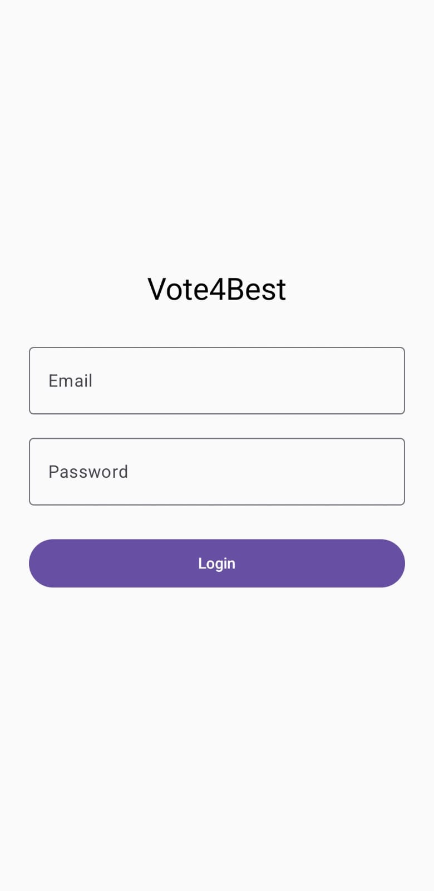

# Vote4Best 📸📍👍  
### A Community-Based Place Voting App (Android)

VotePlace is a modern **Android application** that allows users to **upload photos of places**, automatically capture their **current location**, and let the community **vote** on those places.  
The most voted places are displayed at the top in real time.

This project is built using **Kotlin, Jetpack Compose, Firebase, and MVVM architecture**, focusing on **real-world app features** and **scalable design**.

---

## 🚀 Features

### 👀 Guest Users
- View all uploaded places
- See images, location (city), and vote count
- Most voted places appear on top

### 🔐 Authenticated Users
- Sign up / Login using Email & Password
- Upload place photos using **camera**
- Auto-detect current location (city)
- Vote on places (one vote per user per image)
- Logout securely

---

## 📱 Screens

- Login / Signup Screen
- Home Screen with Bottom Navigation
  - 📸 Upload Place
  - 🗺️ View Places (Voting)
 
 

  
  
</p

---

## 🧠 Core Concepts Demonstrated

- Firebase Authentication (Email & Password)
- Firebase Firestore (Realtime database)
- Firebase Storage (Image upload)
- Location services (current location → city)
- Realtime voting system
- One-vote-per-user logic
- MVVM Architecture
- State management with ViewModel
- Material 3 UI using Jetpack Compose

---

## 🛠️ Tech Stack

- **Language:** Kotlin  
- **UI:** Jetpack Compose + Material 3  
- **Architecture:** MVVM + Clean Architecture principles  
- **Authentication:** Firebase Auth  
- **Database:** Firebase Firestore  
- **Storage:** Firebase Storage  
- **Location:** Fused Location Provider  
- **Build System:** Gradle  

---
